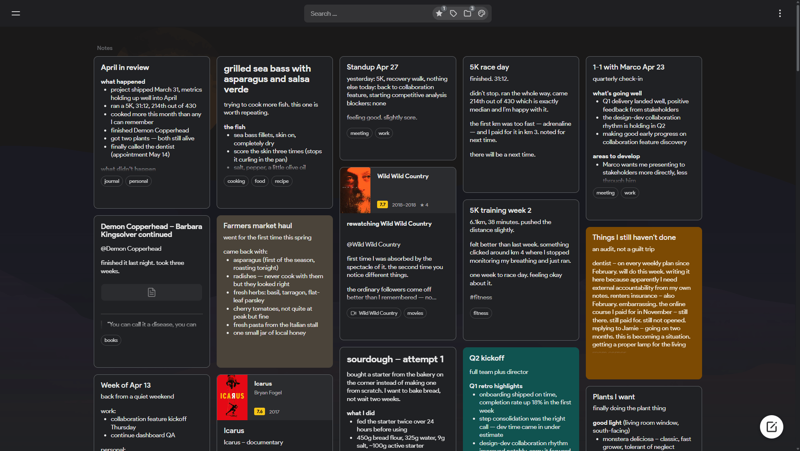
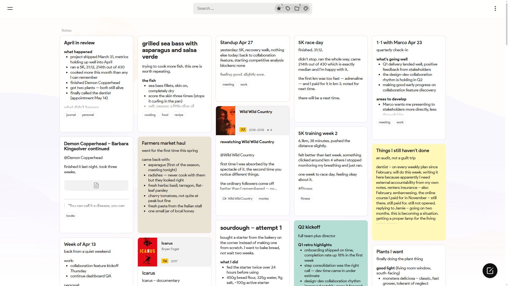
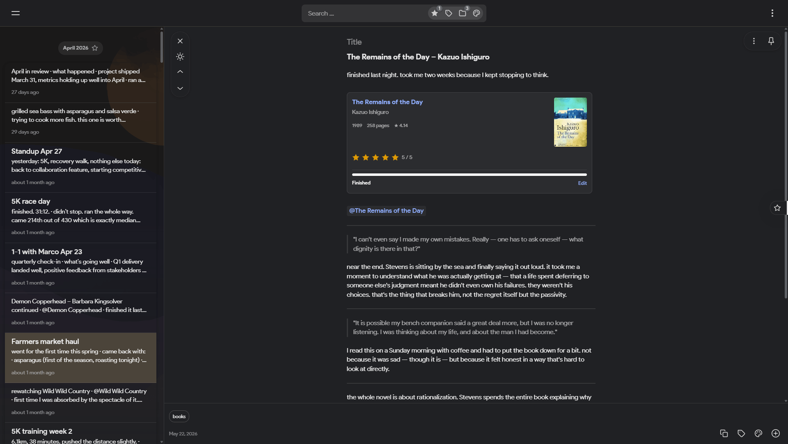
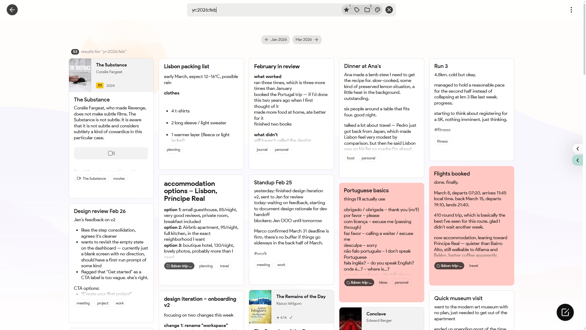
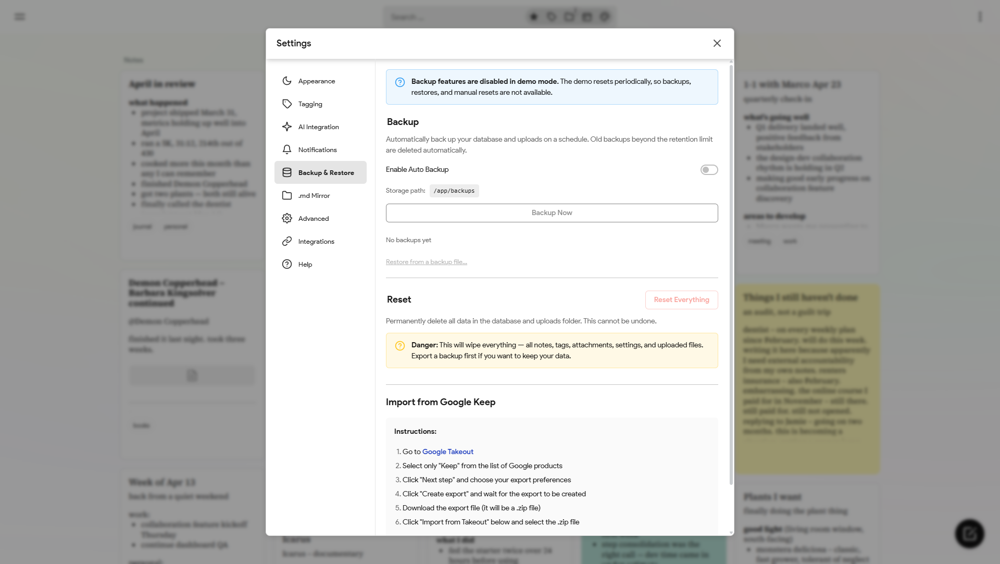
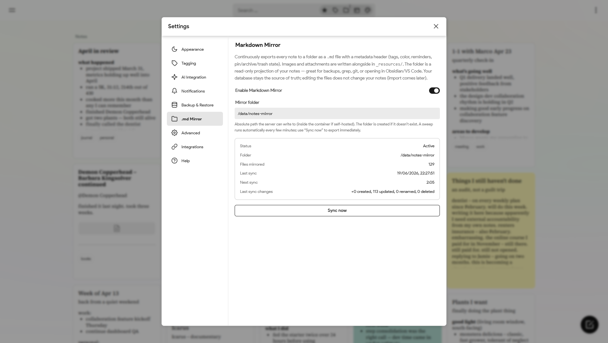
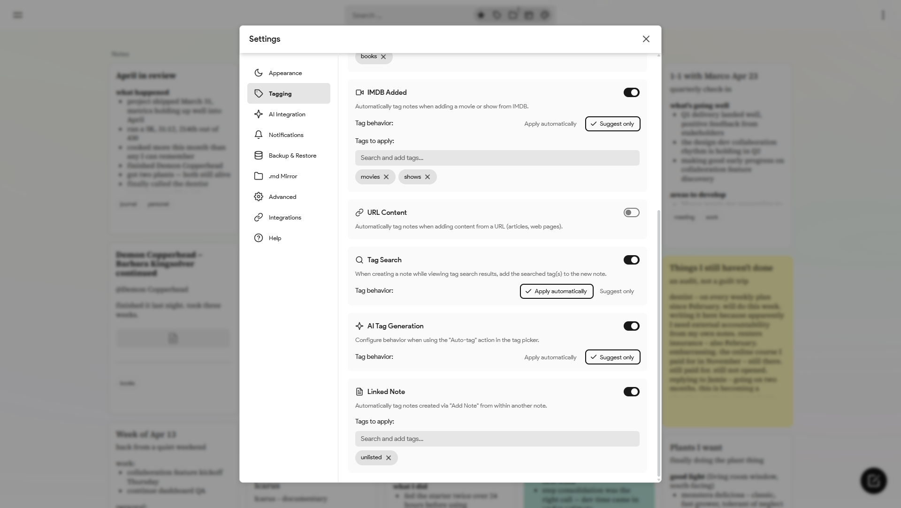
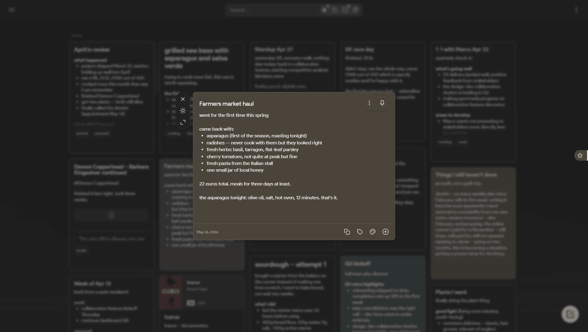
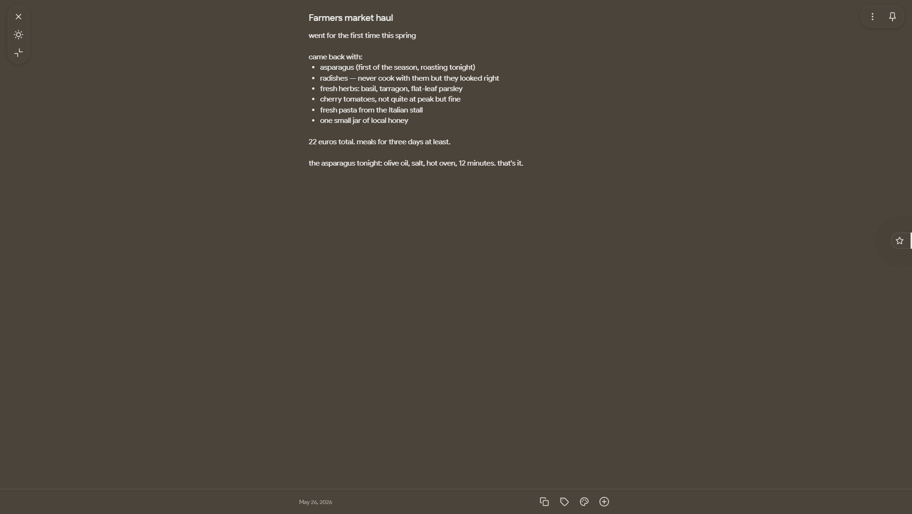
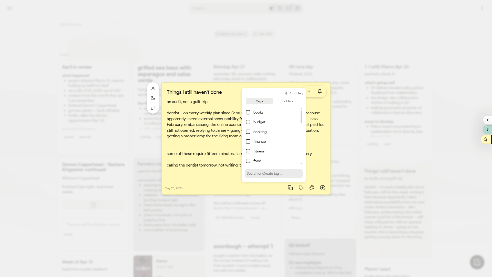

<p align="center"></p>

# itsnotes

A self-hosted Google Keep alternative. It sticks to the familiar masonry layout but overhauls how you actually navigate and organize a large amount of notes.

Instead of an endless wall of text, the feed is broken down by month markers. There are quick-search panels for colors and tags, a basic folder implementation, and a proper list view. It also handles data import natively, so moving off Keep or importing text files is straightforward.

**[Try the demo →](https://try.itsnotes.app)**

**Features:**

- **Better navigation:** The timeline has month markers to break up the list. There are quick-access panels for colors, tags, saved searches, and a calendar.
- **More ways to organize:** Basic folders, internal note linking, and the ability to rename color labels to whatever makes sense to you.
- **View modes:** The standard masonry grid, a stacked view, and a proper dense list view.
- **Customization:** A heavy settings modal to tweak layouts, page backgrounds, and form behaviors.
- **Easy imports:** Drop in a Google Takeout `.zip` to import Keep data, or bulk upload `.txt` and `.md` files directly.
- **Markdown mirror:** Continuously export every note to a folder as a `.md` file with a metadata header (tags, color, reminders, pin/archive/trash state), images and attachments alongside — great for backups, grep, git, or opening in Obsidian.
- **Quality of life:** Built-in note history for revisions, plus automatic metadata fetching for books and movies.
- **Optional AI stuff:** Hooks for auto-tagging and reminder parsing, plus a built-in MCP server so external AI clients can query your database.

Built with React, Node.js, PostgreSQL, and Socket.io.



<table>
  <tr>
    <td></td>
    <td></td>
  </tr>
  <tr>
    <td></td>
    <td></td>
  </tr>
  <tr>
    <td></td>
    <td></td>
  </tr>
  <tr>
    <td></td>
    <td></td>
  </tr>
  <tr>
    <td></td>
    <td></td>
  </tr>
</table>

## Docker Setup

Save this as `docker-compose.yml`:

```yaml
name: itsnotes

services:
  itsnotes-db:
    image: postgres:17-alpine
    restart: unless-stopped
    environment:
      POSTGRES_USER: itsnotesuser
      POSTGRES_PASSWORD: change-this-password
      POSTGRES_DB: itsnotes
    volumes:
      - postgres_data:/var/lib/postgresql/data
    healthcheck:
      test: ["CMD-SHELL", "pg_isready -U itsnotesuser -d itsnotes"]
      interval: 10s
      timeout: 5s
      retries: 5

  itsnotes-server:
    image: ghcr.io/alexmicuplusfour/itsnotes-server:latest
    restart: unless-stopped
    depends_on:
      itsnotes-db:
        condition: service_healthy
    environment:
      NODE_ENV: production
      PORT: 5000
      DB_HOST: itsnotes-db
      DB_PORT: 5432
      DB_USER: itsnotesuser
      DB_PASSWORD: change-this-password
      DB_NAME: itsnotes
      PUPPETEER_EXECUTABLE_PATH: /usr/bin/chromium-browser
      BACKUP_PATH: /app/backups
      # Markdown Mirror target — exported .md files appear in ./notes-mirror on the host
      MD_MIRROR_PATH: /data/notes-mirror
    volumes:
      - attachments_data:/app/uploads
      - backups_data:/app/backups
      # Browsable folder for the Markdown Mirror feature (turn it on in Settings)
      - ./notes-mirror:/data/notes-mirror

  itsnotes-client:
    image: ghcr.io/alexmicuplusfour/itsnotes-client:latest
    restart: unless-stopped
    depends_on:
      - itsnotes-server
    ports:
      - "80:80"

volumes:
  postgres_data:
  attachments_data:
  backups_data:
```

Change the database password (and set any optional values — see [`.env.example`](.env.example)), then start it:

```bash
docker compose up -d
```

The app will be available on port 80.

### With Caddy (HTTPS + domain)

For automatic HTTPS, use [`docker-compose.caddy.example.yml`](docker-compose.caddy.example.yml) instead — it adds a Caddy service. You'll also need a `Caddyfile` ([`Caddyfile.example`](Caddyfile.example)) with your domain. Then `docker compose up -d`; Caddy handles SSL certificates automatically.

## Configuration

All configuration is via the `environment:` blocks in `docker-compose.yml`. See `.env.example` for the full list of available options.

Optional AI features (auto-tagging, OCR, summarization) require an OpenAI or Anthropic API key set as `OPENAI_API_KEY` or `ANTHROPIC_API_KEY`.

## Chatting with your notes (MCP)

There's a built-in [MCP](https://modelcontextprotocol.io/) server that lets Claude (and other AI clients) search and read your notes. Turn it on under **Settings → AI → MCP Server** and generate a token. To connect, paste the URL into Claude's custom connector, or run the `claude mcp add` command it gives you for Claude Code.

It's off by default, read-only, and won't work without the token.

## Importing from Google Keep

If you're moving over from Google Keep, you can bring your notes with you:

1. Go to [Google Takeout](https://takeout.google.com/) and request an export of just **Keep**.
2. Download the resulting `.zip` when it's ready.
3. In itsnotes, open **Settings → Backup & Restore → Import from Google Keep → Import from Takeout** and select the `.zip`.

Notes, labels, colors, archive/trash/pin state, and original timestamps come across. Images and other attachments aren't imported yet — those will stay in your Takeout `.zip`.

---

This project is entirely 𝚟𝚒𝚋𝚎𝚌𝚘𝚍𝚎𝚍.
