<p align="center"></p>

# itsnotes

A self-hosted Google Keep alternative. It sticks to the familiar masonry layout but overhauls how you actually navigate and organize a large amount of notes.

Instead of an endless wall of text, the feed is broken down by month markers. There are quick-search panels for colors and tags, a basic folder implementation, and a proper list view. It also handles data import natively, so moving off Keep or importing text files is straightforward.

**[Try the demo →](https://try.itsnotes.app)**

<a href="https://openalternative.co/itsnotes?utm_source=openalternative&utm_medium=badge&utm_campaign=embed&utm_content=tool-itsnotes" target="_blank"></a>

**Features:**

- **Better navigation:** The timeline has month markers to break up the list. There are quick-access panels for colors, tags, saved searches, and a calendar.
- **More ways to organize:** Basic folders, internal note linking, and the ability to rename color labels to whatever makes sense to you.
- **View modes:** The standard masonry grid, a stacked view, and a proper dense list view.
- **Customization:** A heavy settings modal to tweak layouts, page backgrounds, and form behaviors.
- **Easy imports:** Drop in a Google Takeout `.zip` to import Keep data, or bulk upload `.txt` and `.md` files directly.
- **Markdown mirror:** Two-way sync between your notes and a folder of `.md` files. Every note is continuously written out with a metadata header (tags, color, reminders, pin/archive/trash state) and images/attachments alongside, and edits you make to the files in any editor (Obsidian, VS Code) are pulled back into your notes — automatically if you want. The database stays the source of truth: conflicting edits are kept safe in a `conflicts/` folder and renames are tracked by note ID, never duplicated. Great for backups, grep, git, or living in Obsidian.
- **Quality of life:** Built-in note history for revisions, plus automatic metadata fetching for books and movies.
- **Optional AI stuff:** Hooks for auto-tagging and reminder parsing, plus a built-in MCP server so external AI clients can query your database.

Built with React, Node.js, PostgreSQL, and Socket.io.


<table>
  <tr>
    <td>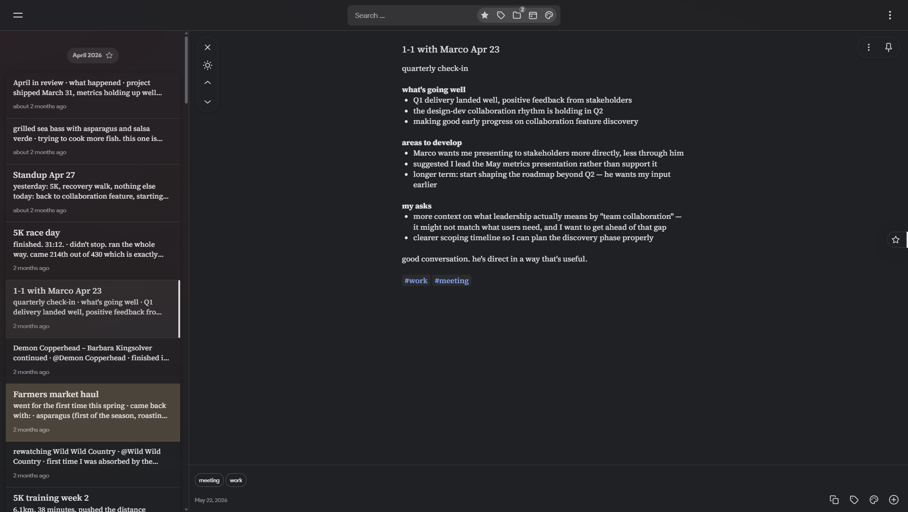</td>
    <td>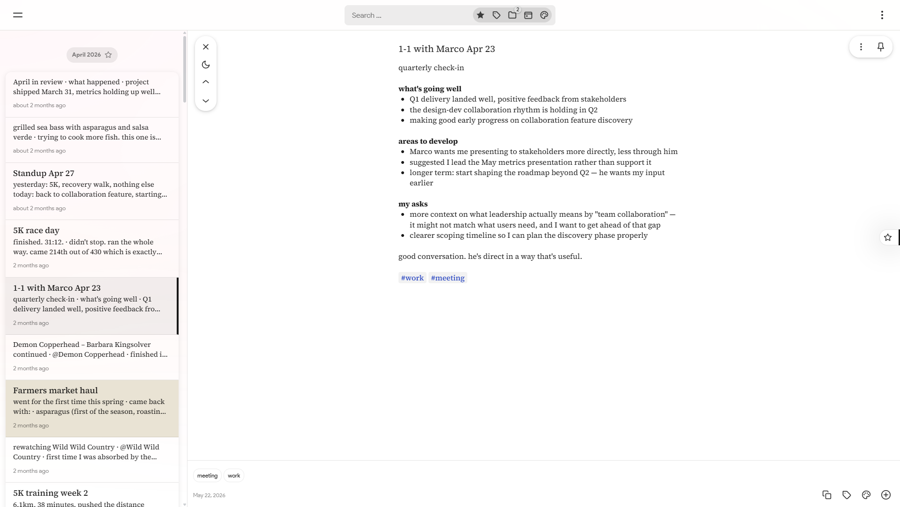</td>
  </tr>
  <tr>
    <td>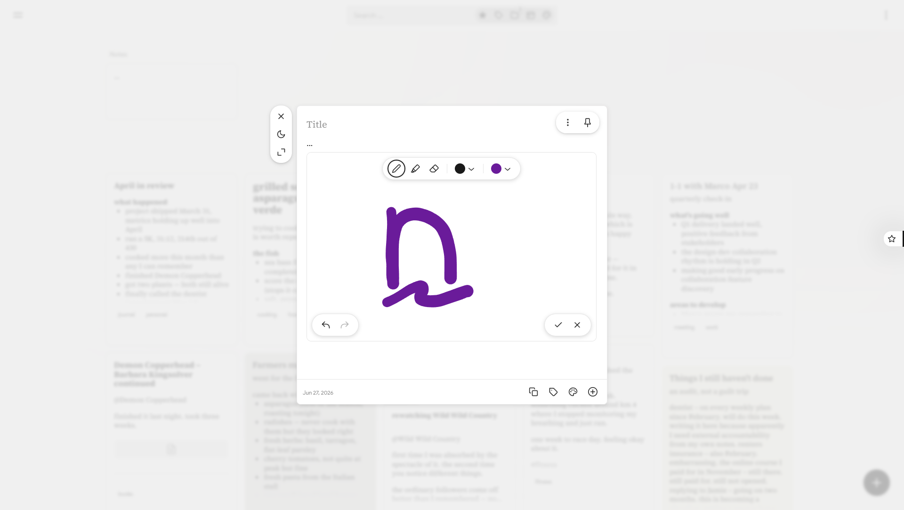</td>
  </tr>
  <tr>
    <td></td>
    <td></td>
  </tr>
  <tr>
    <td></td>
    <td></td>
  </tr>
  <tr>
    <td></td>
    <td></td>
  </tr>
  <tr>
    <td>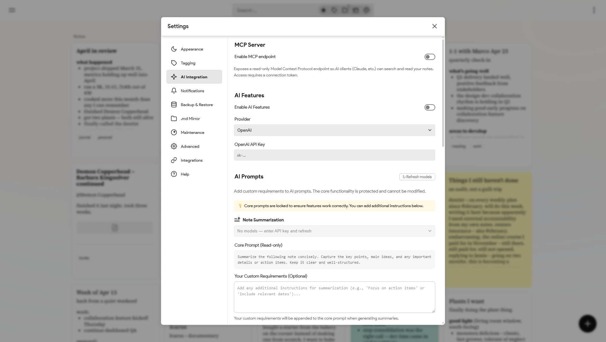</td>
    <td></td>
  </tr>
  <tr>
    <td></td>
  </tr>
</table>

### On mobile

<table>
  <tr>
    <td>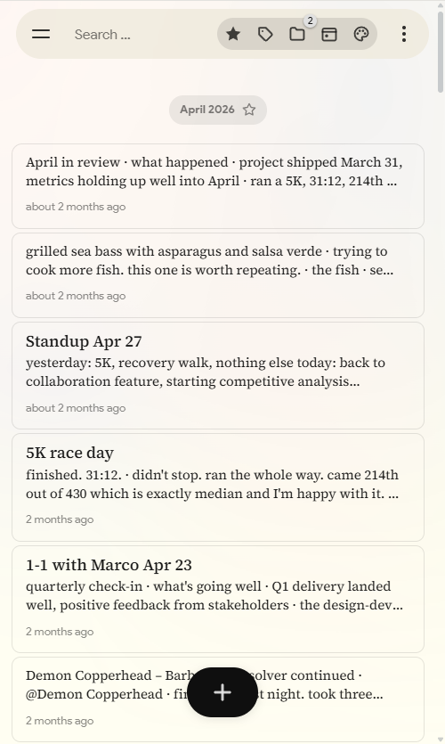</td>
    <td>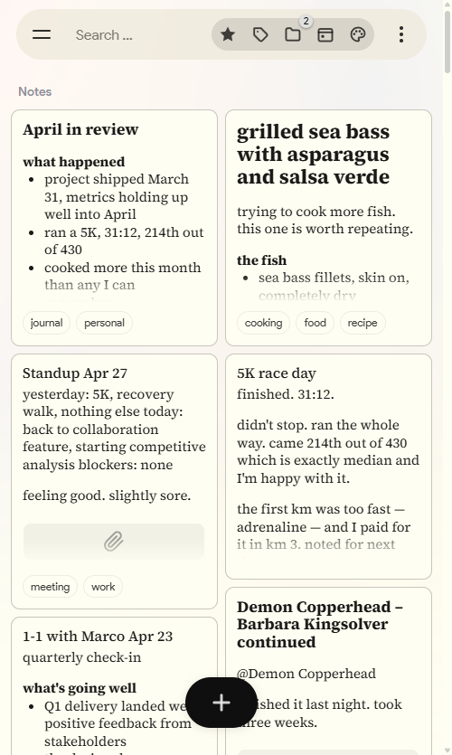</td>
    <td>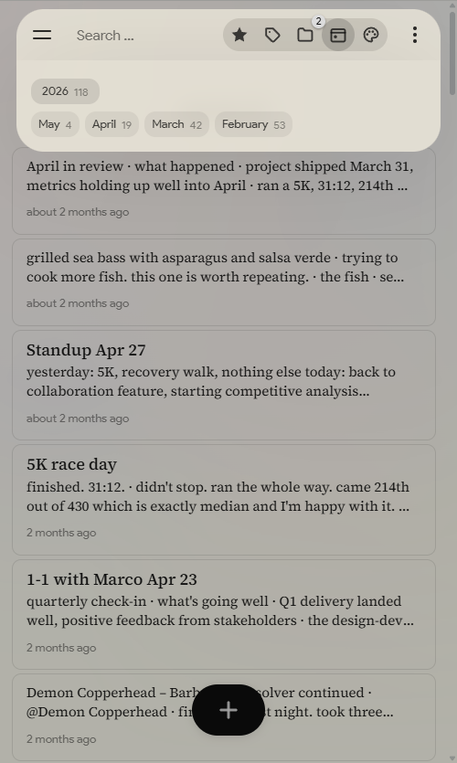</td>
  </tr>
  <tr>
    <td>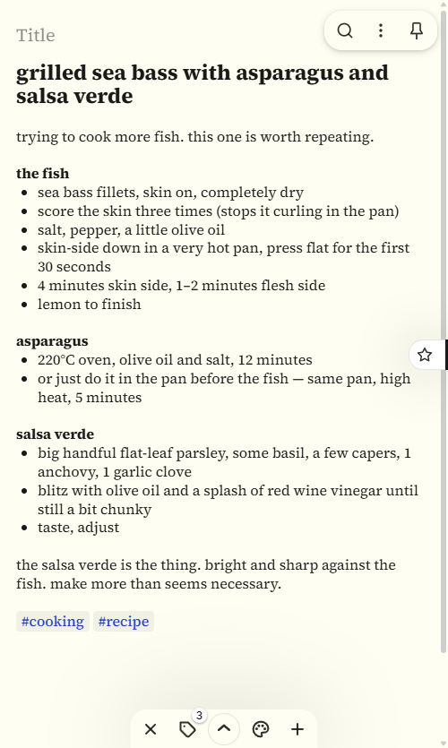</td>
    <td>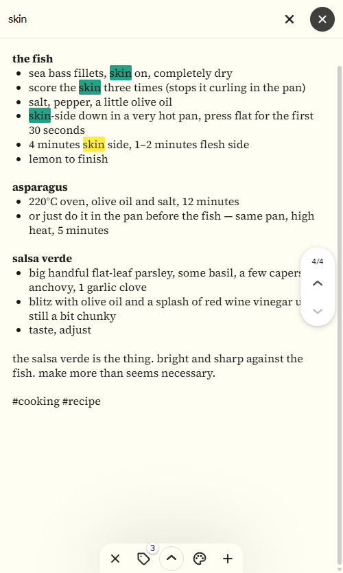</td>
    <td>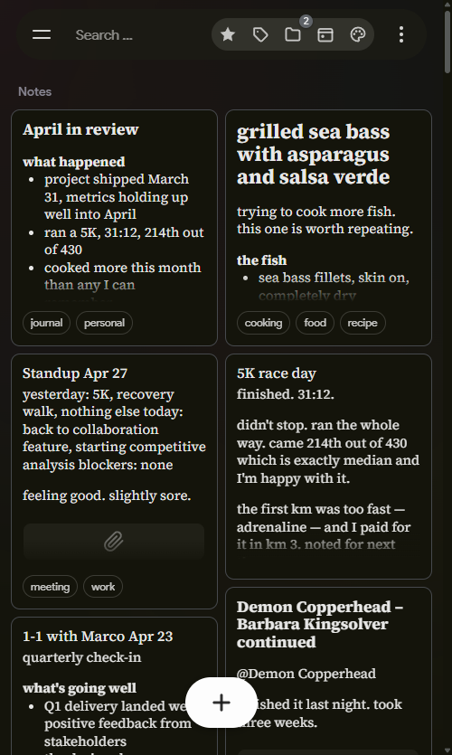</td>
  </tr>
  <tr>
    <td>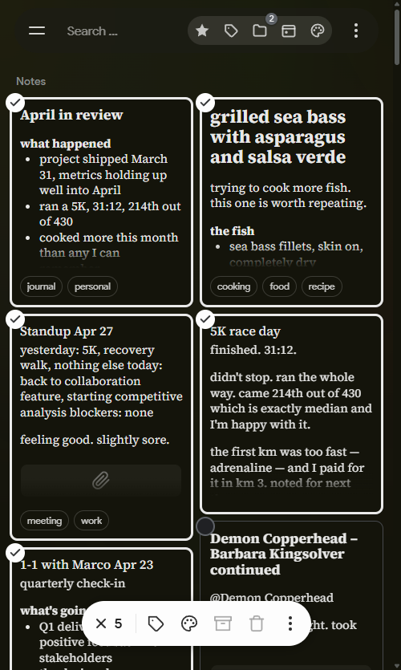</td>
  </tr>
</table>

## Docker Setup

Save this as `docker-compose.yml`:

```yaml
name: itsnotes

services:
  itsnotes-db:
    image: postgres:17-alpine
    restart: unless-stopped
    environment:
      POSTGRES_USER: itsnotesuser
      POSTGRES_PASSWORD: change-this-password
      POSTGRES_DB: itsnotes
    volumes:
      - postgres_data:/var/lib/postgresql/data
    healthcheck:
      test: ["CMD-SHELL", "pg_isready -U $$POSTGRES_USER -d $$POSTGRES_DB"]
      interval: 10s
      timeout: 5s
      retries: 5

  itsnotes-server:
    image: ghcr.io/alexmicuplusfour/itsnotes-server:latest
    restart: unless-stopped
    depends_on:
      itsnotes-db:
        condition: service_healthy
    environment:
      NODE_ENV: production
      PORT: 5000
      DB_HOST: itsnotes-db
      DB_PORT: 5432
      DB_USER: itsnotesuser
      DB_PASSWORD: change-this-password
      DB_NAME: itsnotes
      PUPPETEER_EXECUTABLE_PATH: /usr/bin/chromium-browser
      BACKUP_PATH: /app/backups
      # Markdown Mirror target — exported .md files appear in ./notes-mirror on the host
      MD_MIRROR_PATH: /data/notes-mirror
    volumes:
      - attachments_data:/app/uploads
      - backups_data:/app/backups
      # Browsable folder for the Markdown Mirror feature (turn it on in Settings)
      - ./notes-mirror:/data/notes-mirror

  itsnotes-client:
    image: ghcr.io/alexmicuplusfour/itsnotes-client:latest
    restart: unless-stopped
    depends_on:
      - itsnotes-server
    ports:
      - "80:80"

volumes:
  postgres_data:
  attachments_data:
  backups_data:
```

Change the database password (and set any optional values — see [`.env.example`](.env.example)), then start it:

```bash
docker compose up -d
```

The app will be available on port 80.

### With Caddy (HTTPS + domain)

For automatic HTTPS, use [`docker-compose.caddy.example.yml`](docker-compose.caddy.example.yml) instead — it adds a Caddy service. You'll also need a `Caddyfile` ([`Caddyfile.example`](Caddyfile.example)) with your domain. Then `docker compose up -d`; Caddy handles SSL certificates automatically.

## Configuration

All configuration is via the `environment:` blocks in `docker-compose.yml`. See `.env.example` for the full list of available options.

Optional AI features (auto-tagging, OCR, summarization, reminder parsing) work with three providers, configured under **Settings → AI**:

- **OpenAI** or **Anthropic** — needs an API key (`OPENAI_API_KEY` / `ANTHROPIC_API_KEY`, or just paste it in Settings).
- **[Ollama](https://ollama.com)** — fully local, no API key, and note content never leaves your server.

### Local AI with Ollama

Pick **Ollama** as the provider in Settings → AI and set the base URL:

- itsnotes and Ollama on the same machine, itsnotes in Docker: `http://host.docker.internal:11434` (the compose files already include the `extra_hosts` entry that makes this work on Linux).
- Ollama as a compose service (see the commented-out block in [`docker-compose.example.yml`](docker-compose.example.yml)): `http://ollama:11434`.
- Ollama elsewhere on your network: `http://<that-machine>:11434`.

Then hit **↻ Refresh models** and assign models per feature. What to expect:

- **Auto-tagging & summarization** work well on any ~8B chat model (`llama3.1:8b`, `qwen2.5:7b`, `gemma3`).
- **OCR** needs a *vision* model — `llama3.2-vision`, `qwen3-vl`, or `gemma3`.
- **Reminder parsing** (dates, recurrence rules) is the hardest task — use the largest model you can run.

Two Ollama quirks to know: the first request after idle is slow (the model loads into memory), and Ollama's default context window is small (~4K tokens) — long notes get silently truncated, so summaries may miss the end of the note. Raise it by setting `OLLAMA_CONTEXT_LENGTH=8192` (or higher) in Ollama's environment.

## REST API

The same API the frontend uses is available to external scripts and apps. Log in with your credentials, call `POST /api/auth/api-token` to get a long-lived token, then pass it as a Bearer header on any request:

```bash
curl https://your-instance/api/notes/search?query=yr:2024 \
  -H "Authorization: Bearer <token>"
```

See **[docs/api.md](docs/api.md)** for the full reference: endpoints, query params, search operators, and the note object schema.

## Chatting with your notes (MCP)

There's a built-in [MCP](https://modelcontextprotocol.io/) server that lets Claude (and other AI clients) search and read your notes. Turn it on under **Settings → AI → MCP Server** and generate a token. To connect, paste the URL into Claude's custom connector, or run the `claude mcp add` command it gives you for Claude Code.

It's off by default, read-only, and won't work without the token.

## Importing from Obsidian

If you keep your notes in Obsidian, you can bring your entire vault over:

1. Zip your Obsidian vault folder (the folder that contains your `.md` files and the `.obsidian` config directory).
2. In itsnotes, open **Settings → Backup & Restore → Import from Obsidian** and select the `.zip`.

Alternatively, you can select individual `.md` files if you only want to import a subset.

What comes across: note titles, body text, frontmatter tags (including nested `project/sub` hierarchies), inline `#tags`, `[[wikilinks]]` (resolved to internal note links), `![[embedded images]]`, standard ``, `==highlights==`, task lists, and frontmatter fields for created/modified dates, pinned, and archived state. Obsidian comments (`%%...%%`) are stripped. A two-pass approach ensures wikilinks resolve correctly even when the linked note appears later in the import batch.

## Importing from Google Keep

If you're moving over from Google Keep, you can bring your notes with you:

1. Go to [Google Takeout](https://takeout.google.com/) and request an export of just **Keep**.
2. Download the resulting `.zip` when it's ready.
3. In itsnotes, open **Settings → Backup & Restore → Import from Google Keep → Import from Takeout** and select the `.zip`.

Notes, checklists, labels, colors, archive/trash/pin state, original timestamps, and images all come across. Image attachments land in each note's gallery, and any other attachments are brought over too.

## Alternatives

- **[memos](https://github.com/usememos/memos)** — A lightweight, privacy-first hub for quick notes and memos. Leans toward a fast, microblog-style stream rather than a Keep-like board, and ships as a single Go binary.
- **[Joplin](https://github.com/laurent22/joplin)** — A mature, full-featured note and to-do app with Markdown, end-to-end encryption, web clipper, and sync across desktop, mobile, and web. The heavyweight option if you want notebooks and offline apps everywhere.
- **[Zen](https://github.com/sheshbabu/zen)** — A minimal, single-user self-hosted notes app focused on simplicity and staying out of your way. A good pick if you want something tiny and no-frills.
- **[Karakeep](https://github.com/karakeep-app/karakeep)** — A self-hosted "bookmark everything" app for links, notes, and images, with automatic AI tagging and full-text search. More of a hoarding-and-recall tool than a Keep-style note board.

---

This project is entirely 𝚟𝚒𝚋𝚎𝚌𝚘𝚍𝚎𝚍.
