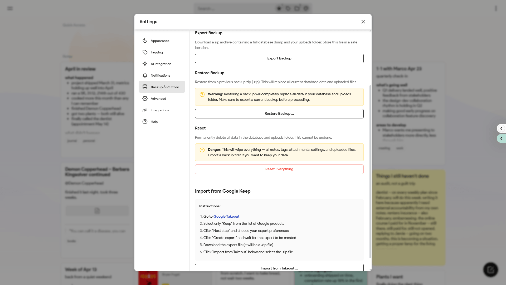

<p align="center"></p>

# itsnotes

A self-hosted Google Keep replacement with rich text, tagging, image attachments, and real-time sync across clients. Built with React, Node.js, PostgreSQL, and Socket.io.


<table>
  <tr>
    <td></td>
    <td></td>
  </tr>
  <tr>
    <td></td>
    <td></td>
  </tr>
  <tr>
    <td></td>
    <td></td>
  </tr>
  <tr>
    <td></td>
    <td></td>
  </tr>
</table>

## Setup

Requires Docker and Docker Compose.

```bash
git clone https://github.com/alexmicuplusfour/itsnotes
cd itsnotes
cp .env.example .env
cp docker-compose.example.yml docker-compose.yml
```

Edit `.env` to set a strong `JWT_SECRET` and your preferred database credentials, then:

```bash
docker compose up -d --build
```
## Configuration

All configuration is via `.env`. See `.env.example` for available options.

Optional AI features (auto-tagging, OCR, summarization) require an OpenAI or Anthropic API key set as `OPENAI_API_KEY` or `ANTHROPIC_API_KEY`.

---

This project is entirely vibecoded.
